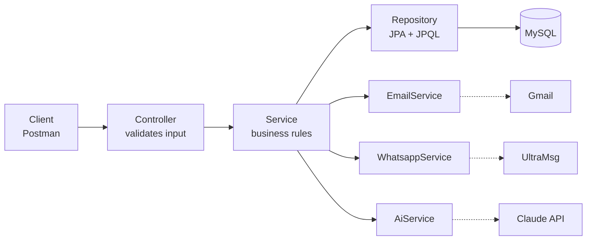
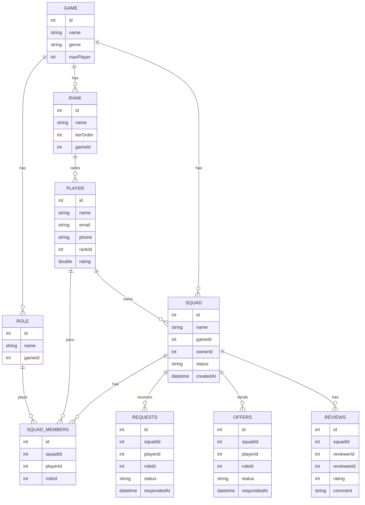

[README.md](https://github.com/user-attachments/files/32708078/README.md)
[GG Squad – Project Pitch-3.pdf](https://github.com/user-attachments/files/32708071/GG.Squad.Project.Pitch-3.pdf)


# 🎮 GG Squad
**Find your squad. Play as one.**

GG Squad is a Spring Boot REST API that helps gamers build balanced teams. Players join squads through **requests**, owners invite players through **offers**, teammates **review** each other, and **AI** scores how well a player fits a squad before anyone joins.

---

## ✨ Features

| Feature | What it does |
|---|---|
| **Join requests** | A player asks to join a squad with a role; the owner accepts or rejects |
| **Squad offers** | The owner invites a player; the player accepts or rejects |
| **Smart rules** | Roles must belong to the squad's game, full or closed squads block joins, no duplicate requests |
| **Squad control** | Open, close, kick, leave, delete, and transfer ownership |
| **Peer reviews** | Teammates rate each other 1–5; a player's rating is the average of real reviews |
| **Top players** | Leaderboard of the five highest-rated players |
| **AI match score** | AI rates squad balance and player-to-squad fit as a percentage with a reason |
| **AI summaries** | AI summarizes a player's reviews and writes a description for each squad |
| **Instant alerts** | Email (Gmail) and WhatsApp (UltraMsg) on sign-up, requests, offers, kicks and more |

---

## 🛠 Tech Stack

- **Java 17** · **Spring Boot**
- **Spring Data JPA** (derived queries + JPQL with `@Query`)
- **MySQL**
- **Lombok** · **Jakarta Validation**
- **Spring Mail** (Gmail SMTP)
- **UltraMsg API** (WhatsApp) · **Claude API** (AI), both called with `RestTemplate`

---

## 🧱 Architecture



Each service method returns a result code for every case, and the controller turns it into a `200` or `400` response with a clear message.

---

## 🗂 Data Model



> The squad owner is stored in `Squad.ownerId` (not in `SquadMembers`), and is counted as a member when checking if a squad is full.
> Requests and offers move through `PENDING → ACCEPTED / REJECTED`.

---

## 🔌 API Endpoints

Base URL: `http://localhost:8080/api/v1`

### Game · Rank · Role · Player (CRUD)
| Method | Endpoint | Description |
|---|---|---|
| GET | `/game/get` | All games |
| POST | `/game/add` | Add a game |
| PUT | `/game/update/{id}` | Update a game |
| DELETE | `/game/delete/{id}` | Delete a game (blocked if it has squads) |
| GET · POST · PUT · DELETE | `/rank/...` · `/role/...` | Same pattern for ranks and roles |
| GET | `/player/get` | All players |
| POST | `/player/add` | Register a player (welcome email + WhatsApp) |
| PUT | `/player/update/{id}` | Update a player |
| DELETE | `/player/delete/{id}` | Delete a player (blocked if owner or member) |
| GET | `/player/top-rated` | Top 5 players by rating |

### Squad
| Method | Endpoint | Description |
|---|---|---|
| GET | `/squad/get` | All squads |
| POST | `/squad/add` | Create a squad (starts `OPEN`) |
| PUT | `/squad/close/{id}/{ownerId}` | Close a squad |
| PUT | `/squad/open/{id}/{ownerId}` | Reopen a squad |
| DELETE | `/squad/delete/{id}/{ownerId}` | Delete a squad and its members |
| DELETE | `/squad/kick/{squadId}/{ownerId}/{playerId}` | Kick a member |
| DELETE | `/squad/leave/{squadId}/{playerId}` | Leave a squad |
| GET | `/squad/members/{squadId}/{ownerId}` | Members with rank and role (owner only) |
| PUT | `/squad/transfer/{squadId}/{ownerId}/{newOwnerId}` | Transfer ownership |
| GET | `/squad/describe/{squadId}` | 🤖 AI description of the squad |
| GET | `/squad/compatibility/{squadId}` | 🤖 AI team compatibility score |
| GET | `/squad/compatibility/{squadId}/{playerId}` | 🤖 AI player-to-squad fit score |

### Requests (player → squad)
| Method | Endpoint | Description |
|---|---|---|
| GET | `/requests/get` | All requests |
| POST | `/requests/make` | Send a join request |
| GET | `/requests/pending/{squadId}/{ownerId}` | Pending requests for a squad |
| PUT | `/requests/accept/{requestId}/{ownerId}` | Accept a request |
| PUT | `/requests/reject/{requestId}/{ownerId}` | Reject a request |
| DELETE | `/requests/delete/{requestId}/{playerId}` | Cancel a pending request |

### Offers (owner → player)
| Method | Endpoint | Description |
|---|---|---|
| GET | `/offers/get` | All offers |
| POST | `/offers/make/{ownerId}` | Send an offer |
| GET | `/offers/pending/{playerId}` | Pending offers for a player |
| PUT | `/offers/accept/{offerId}/{playerId}` | Accept an offer |
| PUT | `/offers/reject/{offerId}/{playerId}` | Reject an offer |
| DELETE | `/offers/delete/{offerId}/{ownerId}` | Cancel a pending offer |

### Reviews
| Method | Endpoint | Description |
|---|---|---|
| GET | `/reviews/get` | All reviews |
| POST | `/reviews/add` | Review a teammate (updates their rating) |
| PUT | `/reviews/update/{id}/{reviewerId}` | Update your review |
| DELETE | `/reviews/delete/{id}/{reviewerId}` | Delete your review |
| GET | `/reviews/summary/{playerId}` | 🤖 AI summary of a player's reviews |

### Example requests

```json
// POST /requests/make
{ "squadId": 1, "playerId": 2, "roleId": 1 }

// POST /reviews/add
{ "squadId": 1, "reviewerId": 2, "revieweeId": 3, "rating": 4, "comment": "Great comms" }
```

```text
// GET /squad/compatibility/1/4
Compatibility: 82%
Reason: His rank is close to the team and he fills the missing Sentinel role.
```

---

## 🚀 Getting Started

### 1. Clone and create the database
```bash
git clone https://github.com/<your-username>/gg-squad.git
```
```sql
CREATE DATABASE gg_squad;
```

### 2. Configure `application.properties`
```properties
spring.datasource.url=jdbc:mysql://localhost:3306/gg_squad
spring.datasource.username=YOUR_DB_USER
spring.datasource.password=YOUR_DB_PASSWORD
spring.jpa.hibernate.ddl-auto=update

# Gmail (use an App Password, not your real password)
spring.mail.host=smtp.gmail.com
spring.mail.port=587
spring.mail.username=YOUR_EMAIL
spring.mail.password=YOUR_APP_PASSWORD
spring.mail.properties.mail.smtp.auth=true
spring.mail.properties.mail.smtp.starttls.enable=true

# WhatsApp (UltraMsg)
whatsapp.instance=YOUR_INSTANCE_ID
whatsapp.token=YOUR_TOKEN

# AI (Claude API)
ai.api.key=YOUR_API_KEY
```

> ⚠️ Never commit real keys or passwords. Keep them out of GitHub.

### 3. Run
Run the Spring Boot application, then test the endpoints with Postman on **http://localhost:8080/api/v1**.

### 4. Suggested order for new data
Game → Rank → Role → Player → Squad → Requests / Offers → Reviews

---

## 🔮 Future Work

- Authentication with Spring Security, so ids come from the logged-in user
- A rank per game for each player (`PlayerRank` table)
- A rank-gap score calculated in code alongside the AI score
- A web front end
- Match history and squad chat

---

## 👩‍💻 Author

**Deema Musaed Althagfi**
